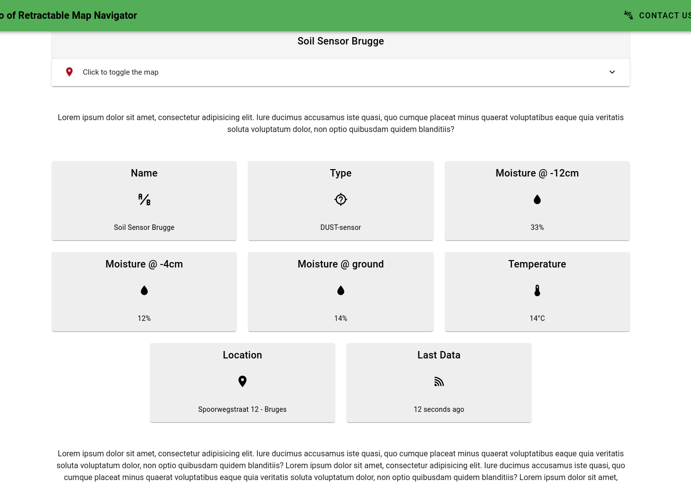
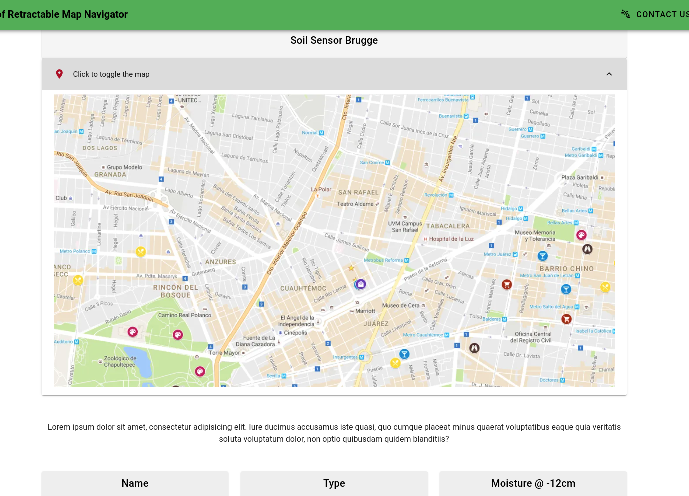

# vue-retractable-map-widgets

Tried different approaches:

* Map Dialog or overlay - looks messy + both need absolute heights / widths
* Map between widgets / growing / shrinking - not very nice + complex
* Best option seemed to be using a `v-expansion-panel`.

Without map



With map



## Project setup
```
yarn install
```

### Compiles and hot-reloads for development
```
yarn serve
```

### Compiles and minifies for production
```
yarn build
```

### Lints and fixes files
```
yarn lint
```

### Customize configuration
See [Configuration Reference](https://cli.vuejs.org/config/).
